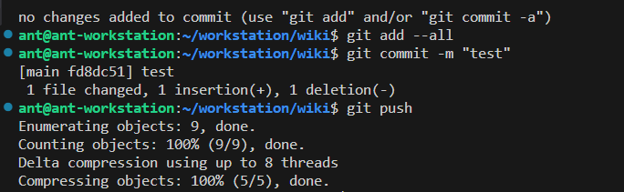

# Что такое dbt

Это отличный инструмент, чтобы привести в порядок таблицы в вашей базе данных

<!-- more -->

Если у вас более 20 таблиц в вашей базе данных и на их основе вы строите отчётность, то dbt - то что нужно.
...