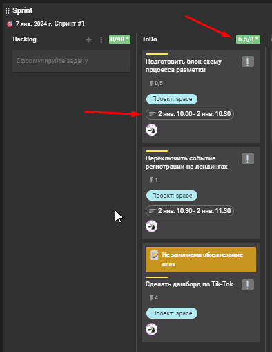

# Использование спринтов в Kaiten

Kaiten - относительно новый инструмент для управления задачами. Я использую его около 3-х лет и за это время сформировались определённые наработки, которыми я хочу поделиться.

<!-- more -->

## Используем модули канбан и Scrum

Сразу хочу предупредить - я не разбираюсь даже в основах этих терминов и просто использую модули встроенные в Kaiten.

В моём понимании Kanban - это определённые этапы, которые проходит задача, трансформируясь от идеи в конкретную выполненную задачу или задачи. Эти этапы представлены в виде доски с колонками, по которым мы перемещаем карточки(задачи).

Этапы я назвали так:

- Ideas
- Backlog
- Todo
- inProcess
- Pause
- Done

## Ideas

Сюда попадают идеи. Идея может возникнуть спонтанно в процессе работы или прилететь со стороны в виде конкретной задачи. В любом случае первоначально она попадает в колонку **Ideas** и **ждёт пока её обработают и добавят в Backlog в виде задачи**. Никаких требований к записи идей нет. Формат произвольный

## Ideas>>Backlog

В начале каждого спринта происходит процесс в результате которого идеи превращаются в задачи. Каждая идея раскладывается на задачи. Название происходит по формуле: Action+Context. Например, **Добавить тесты в модель bi_report\_\_metrics** или **Подготовить документацию по процессу "Добавление отчёта в PowerBI"**.

Затем каждая задача оценивается по размеру. Это необходимо, чтобы сравнить впоследствии время планируемое и реально потраченное на задачу. Такой подход со временем вырабатывает навык более точной оценки сроков. Плюс данный показатель можно использовать как метрику KPI. Размеры задач можно использовать любые, я использую числовые:

- 0.5 - Полчаса
- 1 - Час
- 2 - Два часа
- 4 - Четыре часа
- 8 - Восемь часов

Задачи длительностью более 8 часов декомпозируются. Основные требования к колонке **Backlog** после заполнения:

1. Общий размер задач в ней не может превышать 40 часов
1. У каждой задачи указан проект, размер и описание

Если у задачи не будут указаны обязательные поля, то у такой задачи появляется специальная надпись.

## Backlog >> ToDo

Каждое утро в начале рабочего дня из **Backlog** в колонку **ToDo** перемещаются задачи. До тех пор пока общий размер колонки не составит 8 рабочих часов.

Затем в каждой задаче указывается период, когда задача будет выполняться. В результате мы получаем распланированный рабочий день.

## ToDo >> inProcess

Здесь всё просто. Когда наступает время выполнения задачи, мы перетаскиваем её в **inProcess** колонку. Когда пользователь перетаскивает задачу он автоматически становится её исполнителем. Здесь также есть ограничение. Мы не можем иметь в этой колонке больше одной задачи на исполнителя. такой подход позволяет сконцентрироваться на выполнении только одной задачи.

Здесь всё просто. Когда наступает время выполнения задачи, мы перетаскиваем её в **inProcess** колонку. Когда пользователь перетаскивает задачу он автоматически становится её исполнителем. Здесь также есть ограничение. Мы не можем иметь в этой колонке больше одной задачи на исполнителя. такой подход позволяет сконцентрироваться на выполнении только одной задачи.

## inProcess >> Pause | Done

В процессе выполнения задача может быть поставлена на паузу. В этом случае она перемещается в колонку **Pause**. В паузу можно перевести не более 5 задач. Если задача пробудет в паузе больше 1 дня появится уведомление.

А если задача выполнена, то она перемещается в **Done**.

## Summary

Перечисленные выше этапы и процессы могут быть реализованы в любой системе. Но лично мне нравится Kaiten, потому что он позволяет не только гибко подходить к настройке процесса, но и также собирает статистику, которую потом можно использовать для анализа показателей эффективности.

## Links

- [Кайтен](https://kaiten.ru/)
