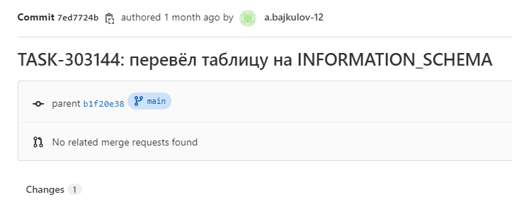

# Как работать с GIT

GIT это хороший инструмент, который помогает вам управлять версиями ваших файлов

<!-- more -->

Если у вас более 20 таблиц в вашей базе данных и на их основе вы строите отчётность, то dbt - то что нужно.
...