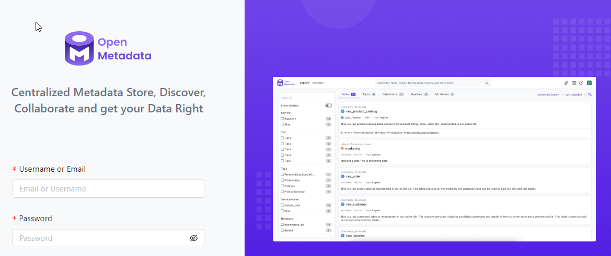

# Что такое PowerBI

Это инструмент помогает собрать все инструменты инфраструктуры в единое целое.
По сути, это единый центр документации всего аналитического проекта.

<!-- more -->

Если у вас более 20 таблиц в вашей базе данных и на их основе вы строите отчётность, то dbt - то что нужно.
...