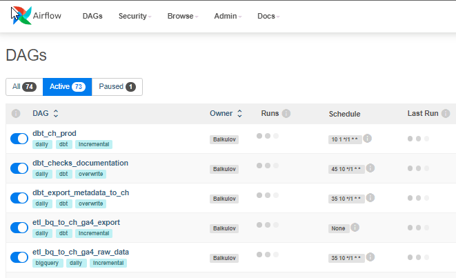

# Что такое airflow
# Что такое airflow

Это инструмент, который помогает управлять большим количеством ваших скриптов.

<!-- more -->

Если у вас более 20 таблиц в вашей базе данных и на их основе вы строите отчётность, то dbt - то что нужно.
...